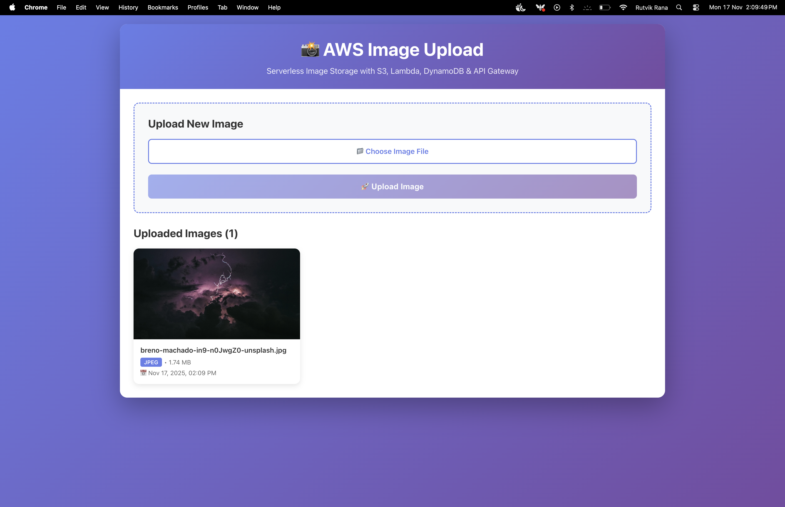

# 📸 AWS Serverless Image Upload System

A production-ready serverless image upload application built with AWS Lambda, S3, DynamoDB, API Gateway, and a React frontend.

## 🎯 Project Overview

This project demonstrates a complete serverless architecture for handling image uploads securely using AWS services. Users can upload images through a beautiful React interface, which connects to AWS API Gateway. Images are stored in S3 with metadata tracked in DynamoDB.

### ✨ Key Features

- 🚀 **Serverless Architecture** - No server management, auto-scaling
- 🔐 **Secure Uploads** - Presigned URLs with 5-minute expiry
- 📊 **Metadata Storage** - DynamoDB for fast queries
- 🎨 **Modern UI** - React frontend with responsive design
- 📈 **Monitoring** - CloudWatch logs and alarms
- ✅ **Validation** - File type and size checks (5MB limit)
- 💰 **Cost-Effective** - Runs on AWS Free Tier

## 📸 Application Demo

### Upload Interface

*User-friendly upload interface with file validation and success feedback*

### Image Gallery with Modal

*Responsive image gallery with full-size modal viewer*

## 🏗️ Architecture

```
┌─────────────────┐
│  React Frontend │
│  (Vite + React) │
└────────┬────────┘
         │ HTTPS
         ▼
┌─────────────────┐
│  API Gateway    │  ← REST API Endpoints
│  /upload (POST) │     • POST /upload
│  /images (GET)  │     • GET /images
└────────┬────────┘
         │ Triggers
         ▼
┌─────────────────────────┐
│   Lambda Functions      │
│ • ImageUploadHandler    │  ← Node.js 18.x
│ • ListImagesHandler     │     Validation & Logic
└────┬────────────────┬───┘
     │                │
     │ Presigned URL  │ Store/Retrieve
     ▼                ▼
┌──────────┐    ┌─────────────┐
│    S3    │    │  DynamoDB   │
│  Bucket  │    │    Table    │
│ (Images) │    │ (Metadata)  │
└──────────┘    └─────────────┘
     │                │
     └────────┬───────┘
              ▼
     ┌─────────────────┐
     │   CloudWatch    │  ← Logs & Alarms
     │  Monitoring     │     SNS Alerts
     └─────────────────┘
```

### Data Flow

**Upload Process:**
1. User selects image in React app
2. Frontend validates file (type + size)
3. API call to `/upload` with metadata
4. Lambda generates presigned S3 URL
5. Lambda stores metadata in DynamoDB
6. Frontend uploads directly to S3
7. Success confirmation displayed

**Display Process:**
1. Frontend calls `/images` on page load
2. Lambda scans DynamoDB table
3. Returns array with image URLs
4. Gallery displays images
5. Click for full-size modal view

## 🛠️ Technologies Used

### Backend (AWS Services)
- **AWS Lambda** - Serverless compute (Node.js 18.x)
- **Amazon S3** - Object storage for images with CORS
- **DynamoDB** - NoSQL database for metadata
- **API Gateway** - REST API endpoints with CORS
- **CloudWatch** - Logging, monitoring, and alarms
- **SNS** - Email notifications for errors
- **IAM** - Security roles and policies

### Frontend
- **React 18** - Modern UI library
- **Vite** - Fast build tool and dev server
- **Vanilla CSS** - Custom responsive styling
- **ES6+** - Modern JavaScript features

### Development Tools
- **Postman** - API testing
- **Git** - Version control
- **npm** - Package management

## 📋 Prerequisites

- AWS Account (Free Tier eligible)
- Node.js 18+ and npm
- Postman (for API testing)
- Basic knowledge of JavaScript/React
- Git for version control
- AWS CLI (optional but recommended)

## 🚀 Quick Start

### 1. Clone the Repository
```bash
git clone <your-repo-url>
cd aws-image-upload
```

### 2. Set Up AWS Resources

Follow the detailed guide in `PROJECT_GUIDE.md` or quick setup below:

1. **Create S3 Bucket**
   - Name: `image-upload-[your-name]-[random]`
   - Region: `ap-south-1` (or your preferred region)
   - Block public access initially
   - Add bucket policy for public GetObject (for demo)
   - Enable CORS configuration

2. **Create DynamoDB Table**
   - Table name: `ImageMetadata`
   - Partition key: `imageId` (String)
   - Billing mode: On-demand

3. **Create IAM Role**
   - Name: `ImageUploadLambdaRole`
   - Attach `AWSLambdaBasicExecutionRole`
   - Add inline policies for S3 and DynamoDB access

4. **Create Lambda Functions**
   
   **Function 1: ImageUploadHandler**
   - Runtime: Node.js 18.x
   - Role: `ImageUploadLambdaRole`
   - Code: Copy from `lambda/index.js`
   - Environment Variables:
     - `BUCKET_NAME`: Your S3 bucket name
     - `TABLE_NAME`: `ImageMetadata`
     - `REGION`: `ap-south-1`
   
   **Function 2: ListImagesHandler**
   - Same settings as above
   - Implement DynamoDB scan to list all images

5. **Create API Gateway**
   - Type: REST API
   - Name: `ImageUploadAPI`
   - Create resources and methods:
     - `POST /upload` → ImageUploadHandler
     - `GET /images` → ListImagesHandler
   - Enable CORS on both
   - Deploy to `prod` stage
   - Copy invoke URL

### 3. Set Up Frontend

```bash
cd frontend
npm install

# Create .env file
cp .env.example .env

# Edit .env and add your API Gateway URL
# VITE_API_BASE_URL=https://your-api-id.execute-api.ap-south-1.amazonaws.com/prod

# Start development server
npm run dev
```

Visit `http://localhost:5173` to see your app!

## 📖 Detailed Documentation

- **[PROJECT_GUIDE.md](./PROJECT_GUIDE.md)** - Complete step-by-step guide with 30+ tasks
- **[AWS_PROJECT_SUMMARY.md](./AWS_PROJECT_SUMMARY.md)** - Quick AWS reference for interviews
- **[docs/api-examples.md](./docs/api-examples.md)** - API testing examples

## 📡 API Documentation

### 1. Upload Image (Generate Presigned URL)

**Endpoint:** `POST /upload`

**Request Body:**
```json
{
  "fileName": "profile.jpg",
  "fileType": "image/jpeg",
  "fileSize": 2048576
}
```

**Response:**
```json
{
  "uploadUrl": "https://bucket.s3.amazonaws.com/presigned-url",
  "fileUrl": "https://bucket.s3.amazonaws.com/uuid-profile.jpg",
  "imageId": "uuid-v4"
}
```

**Validation:**
- File types: `jpeg`, `jpg`, `png`, `gif`, `webp`
- Max size: 5MB
- Required fields: `fileName`, `fileType`, `fileSize`

**Status Codes:**
- `200` - Success
- `400` - Bad Request (validation failed)
- `500` - Internal Server Error

### 2. List All Images

**Endpoint:** `GET /images`

**Response:**
```json
{
  "images": [
    {
      "imageId": "uuid-1",
      "fileName": "profile.jpg",
      "fileUrl": "https://bucket.s3.amazonaws.com/uuid-profile.jpg",
      "fileType": "image/jpeg",
      "fileSize": 2048576,
      "uploadedAt": "2025-11-17T10:30:00.000Z"
    }
  ],
  "count": 1
}
```

**Status Codes:**
- `200` - Success
- `500` - Internal Server Error

## 🧪 Testing

### Using the React Frontend
1. Start the development server: `npm run dev`
2. Open browser at `http://localhost:5173`
3. Click "Choose Image File" and select an image
4. Click "Upload Image"
5. Watch the image appear in the gallery below
6. Click any image to view full-size in modal

### Using Postman (API Testing)

See `docs/api-examples.md` for detailed instructions.

**Quick Test:**
1. **Generate Presigned URL**
   ```
   POST https://your-api.execute-api.ap-south-1.amazonaws.com/prod/upload
   Body: { "fileName": "test.jpg", "fileType": "image/jpeg", "fileSize": 50000 }
   ```

2. **Upload to S3**
   ```
   PUT [uploadUrl from step 1]
   Body: Binary (select image file)
   Headers: Content-Type: image/jpeg
   ```

3. **Verify in S3 Console**
   - Go to S3 bucket
   - Confirm file is uploaded

4. **Verify in DynamoDB**
   - Go to DynamoDB table
   - Check metadata entry exists

5. **List All Images**
   ```
   GET https://your-api.execute-api.ap-south-1.amazonaws.com/prod/images
   ```

## 📊 Monitoring & Observability

### CloudWatch Logs
View Lambda execution logs:
- Log group: `/aws/lambda/ImageUploadHandler`
- Log group: `/aws/lambda/ListImagesHandler`
- Monitor invocations, errors, duration, and memory usage

### CloudWatch Alarms
Configured alarms for:
- Lambda errors (threshold: 5 errors in 5 minutes)
- API Gateway 5XX errors
- SNS topic sends email notifications

### Metrics to Monitor
- Lambda invocation count
- Lambda error count
- Lambda duration (cold start vs warm)
- API Gateway request count
- API Gateway latency
- S3 storage size
- DynamoDB read/write capacity

## 💰 Cost Breakdown

This project runs entirely on **AWS Free Tier**:

| Service | Free Tier Limit | Our Usage | Cost |
|---------|----------------|-----------|------|
| Lambda | 1M requests/month | ~100-500 | $0.00 |
| S3 | 5GB storage, 20K GET, 2K PUT | ~50MB, <100 requests | $0.00 |
| DynamoDB | 25GB storage, 25 RCU/WCU | <1MB, <50 ops | $0.00 |
| API Gateway | 1M requests/month | ~100-500 | $0.00 |
| CloudWatch | 5GB logs, 10 metrics | <100MB, 5 metrics | $0.00 |
| **Total** | - | - | **$0.00** |

⚠️ **Note:** Free tier lasts 12 months. After that, costs are minimal (~$1-2/month for light usage).

## 🔒 Security Best Practices

✅ **Implemented in this project:**

- **S3 Bucket Security**
  - Bucket is private by default
  - Presigned URLs for temporary upload access (5-minute expiry)
  - CORS configured for specific origins
  - Encryption enabled (SSE-S3)

- **IAM Security**
  - Least-privilege principle for Lambda role
  - No hardcoded credentials in code
  - Separate roles for different functions
  - Environment variables for sensitive data

- **API Gateway Security**
  - CORS enabled with proper headers
  - Request validation for required fields
  - Rate limiting (default throttling)

- **Lambda Security**
  - Input validation (file type, size)
  - Error handling to prevent information leakage
  - Environment variables for configuration
  - VPC integration (if needed for production)

- **DynamoDB Security**
  - Encryption at rest enabled
  - IAM-based access control
  - No public access

## 📚 Project Resources

### AWS Resources Created
- ✅ S3 Bucket: `image-upload-rutvikrana-001`
- ✅ DynamoDB Table: `ImageMetadata`
- ✅ Lambda Functions:
  - `ImageUploadHandler` - Generate presigned URLs
  - `ListImagesHandler` - Fetch all images
- ✅ IAM Role: `ImageUploadLambdaRole`
- ✅ API Gateway: `ImageUploadAPI`
- ✅ CloudWatch Alarms: Error monitoring
- ✅ SNS Topic: Email notifications

**API Endpoint:**
```
https://[your-api-id].execute-api.ap-south-1.amazonaws.com/prod
```

### Key Features Implemented
- ✅ File upload with validation (type + size)
- ✅ Presigned URL generation
- ✅ Metadata storage in DynamoDB
- ✅ Image gallery with responsive grid
- ✅ Modal/lightbox for full-size viewing
- ✅ Error handling and user feedback
- ✅ CloudWatch monitoring and alarms
- ✅ SNS email notifications
- ✅ CORS configuration
- ✅ Unique file naming to prevent overwrites

## 🧹 Cleanup Instructions

To avoid future charges (after free tier expires), delete resources in this order:

1. **Empty S3 Bucket First** ⚠️ Important!
   ```bash
   aws s3 rm s3://your-bucket-name --recursive
   ```
   Or use AWS Console: S3 → Bucket → Empty

2. **Delete API Gateway**
   - API Gateway Console → Select API → Actions → Delete

3. **Delete Lambda Functions**
   - Lambda Console → Select function → Actions → Delete

4. **Delete S3 Bucket**
   - S3 Console → Select bucket → Delete

5. **Delete DynamoDB Table**
   - DynamoDB Console → Select table → Delete

6. **Delete IAM Role**
   - IAM Console → Roles → Select role → Delete

7. **Delete CloudWatch Resources**
   - Log Groups: `/aws/lambda/*` → Delete
   - Alarms: Select and delete

8. **Delete SNS Resources**
   - SNS Topic → Delete
   - Email subscription (automatically deleted)

⚠️ **Warning:** This will permanently delete all your images and data!

## 📖 What I Learned

### AWS Services (Hands-on Experience)
- ✅ **AWS Lambda** - Serverless functions, event-driven architecture
- ✅ **Amazon S3** - Object storage, presigned URLs, CORS, bucket policies
- ✅ **DynamoDB** - NoSQL database design, partition keys, on-demand billing
- ✅ **API Gateway** - REST API creation, CORS, Lambda integration
- ✅ **IAM** - Roles, policies, least-privilege principle
- ✅ **CloudWatch** - Logs, metrics, alarms, monitoring
- ✅ **SNS** - Email notifications, alarm integration

### Technical Skills
- ✅ Node.js AWS SDK v3 usage
- ✅ Asynchronous JavaScript (async/await)
- ✅ React state management and hooks
- ✅ RESTful API design patterns
- ✅ Error handling and validation
- ✅ Environment variable management
- ✅ Git version control and GitHub

### Architecture & Design
- ✅ Serverless architecture patterns
- ✅ Event-driven design
- ✅ Separation of concerns (frontend/backend)
- ✅ Security best practices
- ✅ Cost optimization strategies
- ✅ Scalability considerations

### Interview-Ready Topics
- ✅ Why serverless over traditional servers?
- ✅ How presigned URLs work and why they're secure
- ✅ DynamoDB vs SQL databases (when to use NoSQL)
- ✅ IAM roles vs IAM users
- ✅ CORS and why it's needed
- ✅ CloudWatch for debugging and monitoring
- ✅ AWS Free Tier and cost optimization

## 🎯 Future Enhancements

**Planned Features:**
- [ ] User authentication with AWS Cognito
- [ ] Image thumbnail generation (Lambda + Sharp)
- [ ] CloudFront CDN for faster global delivery
- [ ] Image compression before upload
- [ ] Delete image functionality
- [ ] Search and filter images
- [ ] Tags/categories for organization
- [ ] Image optimization pipeline
- [ ] Download original image feature
- [ ] Share image with expiring links
- [ ] Admin dashboard
- [ ] Usage analytics and reporting

**Technical Improvements:**
- [ ] Unit tests for Lambda functions
- [ ] Integration tests for API
- [ ] CI/CD pipeline with GitHub Actions
- [ ] Infrastructure as Code (CloudFormation/Terraform)
- [ ] Docker containerization
- [ ] API versioning
- [ ] Request rate limiting per user
- [ ] Caching with ElastiCache


## 👤 Author

**Your Name**
- GitHub: [@Rutvik1803](https://github.com/rutvik1803)
- LinkedIn: [Rutvik Rana](https://www.linkedin.com/in/rutvik-rana-403378193/)
- Portfolio: [https://rutvik-rana.vercel.app](https://rutvik-rana.vercel.app)

---


## 📧 Support

For questions or issues:
- Open an [issue](https://github.com/rutvik1803/aws-image-uploader/issues)
- Email: rutvik.rana06@gmail.com

---


## 📄 License

This project is for educational purposes.

## 🤝 Contributing

Feel free to fork and improve this project!

---

Built with ☁️ AWS Serverless Services
